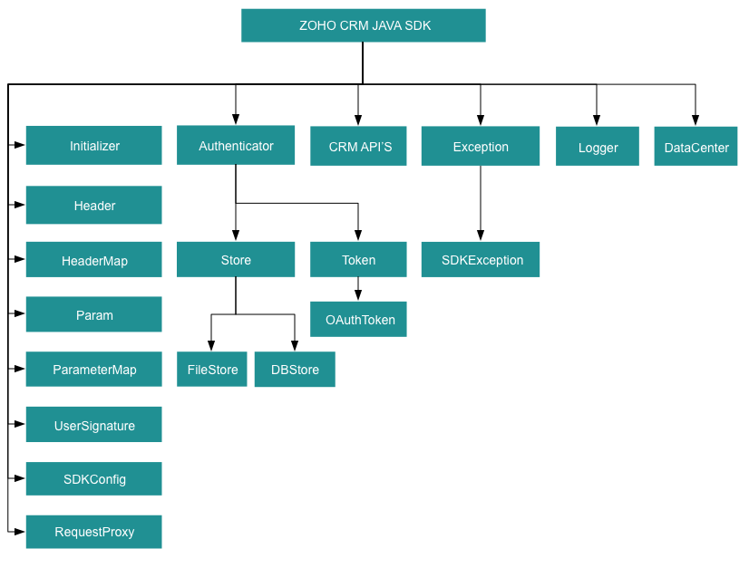

# Archival Notice:

This SDK is archived. You can continue to use it, but no new features or support requests will be accepted. For the new version, refer to

ZOHO CRM v2 API SDK :
- [GitHub Repository](https://github.com/zoho/zohocrm-ruby-sdk-2.0)
- [Help Doc](https://www.zoho.com/crm/developer/docs/server-side-sdks/v3/ruby.html)

ZOHO CRM v2.1 API SDK :
- [GitHub Repository](https://github.com/zoho/zohocrm-ruby-sdk-2.1)

# Ruby SDK

## Overview

RUBY SDK offers a way to create client Ruby applications that can be integrated with Zoho CRM.

## Registering a Zoho Client

Since Zoho CRM APIs are authenticated with OAuth2 standards, you should register your client app with Zoho. To register your app:

- Visit this page [https://api-console.zoho.com/](https://api-console.zoho.com)

- Click `ADD CLIENT`.

- Choose a `Client Type`.

- Enter **Client Name**, **Client Domain** or **Homepage URL** and **Authorized Redirect URIs**. Click `CREATE`.

- Your Client app will be created and displayed.

- Select the created OAuth client.

- Generate grant token by providing the necessary scopes, time duration (the duration for which the generated token is valid) and Scope Description.

## Environmental Setup

RUBY SDK requires Ruby (version 2.6 and above) to be set up in your development environment.


## Including the SDK in your project

Ruby SDK is available through Gem . You can download the gem using:
`gem install ZCRMSDK` 

You can include the SDK to your project using:
`require 'ZCRMSDK'`


## Token Persistence

Token persistence refers to storing and utilizing the authentication tokens that are provided by Zoho. There are three ways provided by the SDK in which persistence can be utilized. They are DataBase Persistence, File Persistence, and Custom Persistence.

### Table of Contents

- DataBase Persistence(mysql)

- File Persistence(csv)

- Custom Persistence

### Implementing OAuth Persistence

Once the application is authorized, OAuth access and refresh tokens can be used for subsequent user data requests to Zoho CRM. Hence, they need to be persisted by the client app.

The persistence is achieved by extending the Store::TokenStore class **[TokenStore](src/com/zoho/api/authenticator/store/token_store.rb)**, which has the following callback methods.

- **get_token([UserSignature](resources/UserSignature.md#usersignature) user, [Token](src/com/zoho/api/authenticator/Token.rb) token)** - invoked before firing a request to fetch the saved tokens. This method should return an implementation of **Token** object for the library to process it.

- **save_token([UserSignature](resources/UserSignature.md#usersignature) user, [Token](src/com/zoho/api/authenticator/Token.ruby) token)** - invoked after fetching access and refresh tokens from Zoho.

- **delete_token([Token](src/com/zoho/api/authenticator/Token.ruby) token)** - invoked before saving the latest tokens.

- **get_tokens()** - The method to retrieve all the stored tokens.

- **delete_tokens()** - The method to delete all the stored tokens.

### DataBase Persistence

In case the user prefers to use the default DataBase persistence, **MySQL** can be used.

- The database name should be **zohooauth**.

- There must be a table named **oauthtoken** with the following columns.

  - id int(11)
  
  - user_mail varchar(255)

  - client_id varchar(255)

  - refresh_token varchar(255)

  - access_token varchar(255)

  - grant_token varchar(255)

  - expiry_time varchar(20)

#### MySQL Query

```sql
create table oauthtoken(id int(11) not null auto_increment, user_mail varchar(255) not null, client_id varchar(255), refresh_token varchar(255), access_token varchar(255), grant_token varchar(255), expiry_time varchar(20), primary key (id))

alter table oauthtoken auto_increment = 1
```

#### Create DBStore object

```ruby

# 1 -> DataBase host name. Default value "localhost"
# 2 -> DataBase name. Default  value "zohooauth"
# 3 -> DataBase user name. Default value "root"
# 4 -> DataBase password. Default value ""
# 5 -> DataBase port number. Default value "3306"

tokenstore = Store::DBStore.new() 
tokenstore = Store::DBStore.new("hostName", "dataBaseName", "userName", "password", "portNumber")
```

### File Persistence

In case of default File Persistence, the user can persist tokens in the local drive, by providing the the absolute file path to the FileStore object.

- The File contains.

  - user_mail

  - client_id

  - refresh_token

  - access_token

  - grant_token

  - expiry_time

#### Create FileStore object

```ruby
#Parameter containing the absolute file path to store tokens
tokenstore = FileStore.new("/Users/user_name/Documents/ruby_sdk_token.txt")
```

### Custom Persistence

To use Custom Persistence, the user must extend **Store::TokenStore** and include the methods.

```ruby
require 'ZCRMSDK'
# This class stores the user token details to the file.
  class TokenStore
    # This method is used to get the user token details.
    # @param user A UserSignature class instance.
    # @param token A Token class instance.
    # @return A Token class instance representing the user token details.
    # @raise SDKException
    def get_token(user, token); end

    def get_tokens; end

    # This method is used to store the user token details.
    # @param user A UserSignature class instance.
    # @param token A Token class instance.
    # @raise SDKException
    def save_token(user, token); end

    # This method is used to delete the user token details.
    # @param user A User class instance.
    # @param token A Token class instance.
    # @raise SDKException
    def delete_token(token); end

    def delete_tokens; end
  end


```

## Configuration

Before you get started with creating your Ruby application, you need to register your client and authenticate the app with Zoho.

- Create an instance of **[SDKLog::Log](resources/logger/Logger.md#logger)** Class to log exception and API information.

    ```ruby
    #
        # Create an instance of SDKLog::Log Class that takes two parameters
        # 1 -> Level of the log messages to be logged. Can be configured by typing Levels "::" and choose any level from the list displayed.
        # 2 -> Absolute file path, where messages need to be logged.
    #
    log = SDKLog::Log.initialize(Levels::INFO,"/Users/user_name/Documents/rubysdk_log.log")
    ```

- Create an instance of **[UserSignature](resources/UserSignature.md#usersignature)** that identifies the current user.

    ```ruby
    #Create an UserSignature instance that takes user Email as parameter
    user_signature = UserSignature.new('abc@zohocorp.com')
    ```

- Configure API environment which decides the domain and the URL to make API calls.

    ```ruby
    
    #Configure the environment
    #which is of the pattern DC::Domain::Environment
    #Available Domains: USDataCenter, EUDataCenter, INDataCenter, CNDataCenter, AUDataCenter
    #Available Environments: PRODUCTION, DEVELOPER, SANDBOX
    
    environment = DC::USDataCenter::PRODUCTION
    ```

- Create an instance of [Authenticator::OAuthToken](resources/token/OAuthToken.md#oauthtoken) with the information  that you get after registering your Zoho client.

    ```ruby
    
    #Create a Token instance
    #1 -> OAuth client id.
    #2 -> OAuth client secret.
    #3 -> REFRESH/GRANT token.
    #4 -> Token type(REFRESH/GRANT).
    #5 -> OAuth redirect URL.(optional)
    

    token = Authenticator::OAuthToken.new("clientId", "clientSecret", "REFRESH/GRANT token", TokenType::REFRESH/GRANT, "redirectURL")
    ```

- Create an instance of [TokenStore](src/com/zoho/api/authenticator/store/token_store.rb) to persist tokens that are  used for authenticating all the requests.

    ```ruby
    
    #Create an instance of TokenStore.
    #1 -> DataBase host name. Default "localhost"
    #2 -> DataBase name. Default "zohooauth"
    #3 -> DataBase user name. Default "root"
    #4 -> DataBase password. Default ""
    #5 -> DataBase port number. Default "3306"
    
    tokenstore = Store::DBStore.new("hostName", "dataBaseName", "userName", "password", "portNumber")

    tokenstore = Store::FileStore.new("/Users/user_name/Documents/ruby_sdk_token.txt")

    tokenStore = CustomStore.new
    ```

- Create an instance of [SDKConfig](resources/SDKConfig.md) containing the SDK configuration.

    ```ruby
    
     # auto_refresh_fields
     # if true - all the modules' fields will be auto-refreshed in the background, every    hour.
     # if false - the fields will not be auto-refreshed in the background. The user can manually delete the file(s) or refresh the fields using methods from ModuleFieldsHandler (Util::ModuleFieldsHandler)
     #
     # pickListValidation
     # if true - value for any picklist field will be validated with the available values.
     # if false - value for any picklist field will not be validated, resulting in creation of a new value.
     #
     # open_timeout
     # Number of seconds to wait for the connection to open (default 60 seconds)
     # 
     # read_timeout
     # Number of seconds to wait for one block to be read (via one read(2) call) (default 60 seconds)
     # 
     # write_timeout
     # Number of seconds to wait for one block to be written (via one write(2) call) (default 60 seconds)
     # 
     # keep_alive_timeout
     # Seconds to reuse the connection of the previous request(default 2 seconds)
     # 

    sdk_config = SDKConfig::Builder.new.auto_refresh_fields(false).pick_list_validation(true).open_timeout(60).read_timeout(60).write_timeout(60).keep_alive_timeout(2).build


- The path containing the absolute directory path to store user-specific files containing module fields information.

    ```ruby
    resource_path = "/Users/user_name/Documents/rubysdk-application"
    ```

- Create an instance of [RequestProxy](resources/RequestProxy.md) containing the proxy properties of the user.

    ```ruby
    request_proxy = RequestProxy.new("proxyHost", "proxyPort", "proxyUser", "password")
    ```

## Initializing the Application

Initialize the SDK using the following code.

```ruby
require 'ZCRMSDK'

class Initialize
    def self.initialize() 
        # Create an instance of Log::SDKLog Class that takes two parameters
        #1 -> Level of the log messages to be logged. Can be configured by typing Levels "::" and choose any level from the list displayed.
        # 2 -> Absolute file path, where messages need to be logged.
        
        log = SDKLog::Log.initialize(Levels::INFO,"/Users/user_name/Documents/rubysdk_log.log")

        #Create an UserSignature instance that takes user Email as parameter
        user_signature = UserSignature.new('abc@zohocorp.com')

        
        # Configure the environment
        # which is of the pattern Domain.Environment
        # Available Domains: USDataCenter, EUDataCenter, INDataCenter, CNDataCenter, AUDataCenter
        # Available Environments: PRODUCTION, DEVELOPER, SANDBOX
        
        environment = DC::USDataCenter.PRODUCTION

         #Create a Token instance
        #1 -> OAuth client id.
        #2 -> OAuth client secret.
        #3 -> REFRESH/GRANT token.
        #4 -> Token type(REFRESH/GRANT).
        #5 -> OAuth redirect URL.(optional)
    
    
        token = Authenticator::OAuthToken.new("clientId", "clientSecret", "REFRESH/GRANT token", TokenType::REFRESH/GRANT, "redirectURL")

        #Create an instance of TokenStore.
        #1 -> DataBase host name. Default "localhost"
        #2 -> DataBase name. Default "zohooauth"
        #3 -> DataBase user name. Default "root"
        #4 -> DataBase password. Default ""
        #5 -> DataBase port number. Default "3306"

        tokenstore = Store::DBStore.new("hostName", "dataBaseName", "userName", "password", "portNumber")

        #tokenstore = Store::FileStore.new("/Users/user_name/Documents/ruby_sdk_token.txt"


        # auto_refresh_fields
        # if true - all the modules' fields will be auto-refreshed in the background, every    hour.
        # if false - the fields will not be auto-refreshed in the background. The user can manually delete the file(s) or refresh the fields using methods from ModuleFieldsHandler (Util::ModuleFieldsHandler)
        #
        # pickListValidation
        # if true - value for any picklist field will be validated with the available values.
        # if false - value for any picklist field will not be validated, resulting in creation of a new value.
        #
        # open_timeout
        # Number of seconds to wait for the connection to open (default 60 seconds)
        # 
        # read_timeout
        # Number of seconds to wait for one block to be read (via one read(2) call) (default 60 seconds)
        # 
        # write_timeout
        # Number of seconds to wait for one block to be written (via one write(2) call) (default 60 seconds)
        # 
        # keep_alive_timeout
        # Seconds to reuse the connection of the previous request(default 2 seconds)
        # 
        
        sdk_config = SDKConfig::Builder.new.auto_refresh_fields(false).pick_list_validation(true).open_timeout(60).read_timeout(60).write_timeout(60).keep_alive_timeout(2).build

        resource_path = "/Users/user_name/Documents/rubysdk-application"
        
        # Create an instance of RequestProxy class that takes the following parameters
        # 1 -> Host
        # 2 -> Port Number
        # 3 -> User Name
        # 4 -> Password
        
        request_proxy = RequestProxy.new("proxyHost", "proxyPort", "proxyUser", "password")

        
        # The initialize method of Initializer class that takes the following arguments
        # 1 -> UserSignature instance
        # 2 -> Environment instance
        # 3 -> Token instance
        # 4 -> TokenStore instance
        # 5 -> SDKConfig instance
        # 6 -> resourcePath -A String
        # 7 -> Log instance (optional)
        # 8 -> RequestProxy instance (optional)

        #The following is the initialize method

        Initializer.initialize(user, environment, token, store, sdk_config, resources_path, log, request_proxy)
    end
end

```

- You can now access the functionalities of the SDK. Refer to the sample codes to make various API calls through the SDK.

## Class Hierarchy



## Responses and Exceptions

All SDK method calls return an instance of the **[APIResponse](resources/util/APIResponse.md#apiresponse)** class.

Use the **data_object** to get the returned **[APIResponse](resources/util/APIResponse.md#apiresponse)** object to obtain the response handler interface depending on the type of request (**GET, POST,PUT,DELETE**).

**APIResponse&ltResponseHandler&gt** and **APIResponse&ltActionHandler&gt** are the common wrapper objects for Zoho CRM APIs’ responses.

Whenever the API returns an error response, the response will be an instance of **APIException** class.

All other exceptions such as SDK anomalies and other unexpected behaviours are thrown under the **[SDKException](resources/exception/SDKException.md#sdkexception)** class.

- For operations involving records in Tags
  - **APIResponse&ltRecordActionHandler&gt**

- For getting Record Count for a specific Tag operation
  
  - **APIResponse&ltCountHandler&gt**

- For operations involving BaseCurrency

  - **APIResponse&ltBaseCurrencyActionHandler&gt**

- For Lead convert operation

  - **APIResponse&ltConvertActionHandler&gt**

- For retrieving Deleted records operation

  - **APIResponse&ltDeletedRecordsHandler&gt**

- For  Record image download operation

  - **APIResponse&ltDownloadHandler&gt**

- For MassUpdate record operations

  - **APIResponse&ltMassUpdateActionHandler&gt**

  - **APIResponse&ltMassUpdateResponseHandler&gt**

### GET Requests

- The **data_object** variable of the returned APIResponse instance returns the response handler interface.

- The **ResponseHandler**  encompasses the following
  - **ResponseWrapper class** (for **application/json** responses)
  - **FileBodyWrapper class** (for File download responses)
  - **APIException class**

- The **CountHandler** encompasses the following
  - **CountWrapper class** (for **application/json** responses)
  - **APIException class**

- The **DeletedRecordsHandler** encompasses the following
  - **DeletedRecordsWrapper class** (for **application/json** responses)
  - **APIException class**

- The **DownloadHandler** encompasses the following
  - **FileBodyWrapper class** (for File download responses)
  - **APIException class**

- The **MassUpdateResponseHandler** encompasses the following
  - **MassUpdateResponseWrapper class** (for **application/json** responses)
  - **APIException class**

### POST, PUT, DELETE Requests

- The **data_object** variable of the returned APIResponse instance returns the action handler interface.

- The **ActionHandler** encompasses the following
  - **ActionWrapper class** (for **application/json** responses)
  - **APIException class**

- The **ActionWrapper class** contains **Property/Properties** that may contain one/list of **ActionResponse interfaces**.

- The **ActionResponse** encompasses the following
  - **SuccessResponse class** (for **application/json** responses)
  - **APIException class**

- The **ActionHandler** encompasses the following
  - **ActionWrapper class** (for **application/json** responses)
  - **APIException class**

- The **RecordActionHandler** encompasses the following
  - **RecordActionWrapper class** (for **application/json** responses)
  - **APIException class**

- The **BaseCurrencyActionHandler** encompasses the following
  - **BaseCurrencyActionWrapper class** (for **application/json** responses)
  - **APIException class**

- The **MassUpdateActionHandler** encompasses the following
  - **MassUpdateActionWrapper class** (for **application/json** responses)
  - **APIException class**

- The **ConvertActionHandler** encompasses the following
  - **ConvertActionWrapper class** (for **application/json** responses)
  - **APIException class**

## Threading in the Ruby SDK

Threads in a Ruby program help you achieve parallelism. By using multiple threads, you can make a Ruby program run faster and do multiple things simultaneously.

The **Ruby SDK** (from version 0.0.x) supports both single-threading and multi-threading irrespective of a single-user or a multi-user app.

### Multithreading in a Multi-user App

Multi-threading for multi-users is achieved using Initializer's static **switch_user()**.

```ruby
Initializer.switch_user(user, environment, token, sdk_config)

Initializer.switch_user(user, environment, token, sdk_config, proxy)
```

Here is a sample code to depict multi-threading for a multi-user app.

```ruby
require 'ZCRMSDK'

module MultiUser
    class MultiThreading
        def initialize(module_api_name)
            @module_api_name = module_api_name
        end
        def execute(user_signature, environment, token,tokenstore, sdk_config,resources_path, log, proxy)
            Initializer.initialize(user_signature, environment, token, tokenstore, sdk_config, resources_path, log)
            token1 =Authenticator::OAuthToken.new("clientId", "clientSecret", "REFRESH/GRANT token", TokenType::REFRESH/GRANT, "redirectURL")
            user1 = UserSignature.new('abc@zohocorp.com')
            environment1 = DC::USDataCenter::PRODUCTION
            sdk_config1 = SDKConfig::Builder.new.auto_refresh_fields(false).pick_list_validation(true).build
            t1 = Thread.new{func1(user1,environment1,token1,sdk_config1)}
            token2 = Authenticator::OAuthToken.new("clientId", "clientSecret", "REFRESH/GRANT token", TokenType::REFRESH/GRANT, "redirectURL")
            user2 = UserSignature.new('dfg@zohocorp.com')
            environment2 = DC::USDataCenter::PRODUCTION
            sdk_config2 = SDKConfig::Builder.new.auto_refresh_fields(false).pick_list_validation(true).build
            t2 = Thread.new{func1(user2,environment2,token2,sdk_config2)}
            t1.join
            t2.join
        end
        def func1(user,environment,token,sdk_config)
            Initializer.switch_user(user,environment,token,sdk_config)
            print Initializer.get_initializer.user.email
            ro = Record::RecordOperations.new
            ro.get_records(@module_api_name,nil,nil)
        end
    end
end
log = SDKLog::Log.initialize(Levels::INFO,"/Users/user_name/Documents/rubysdk_log.log")
user_signature = UserSignature.new('abc@zohocorp.com')
environment = DC::USDataCenter::PRODUCTION
token = Authenticator::OAuthToken.new("clientId", "clientSecret", "REFRESH/GRANT token", TokenType::REFRESH/GRANT, "redirectURL")
tokenstore = Store::FileStore.new("/Users/user_name/Documents/ruby_sdk_token.txt")
sdk_config = SDKConfig::Builder.new.auto_refresh_fields(false).pick_list_validation(true).build
proxy = RequestProxy.new("proxyHost", "proxyPort", "proxyUser", "password")
module_api_name = "Leads"
resource_path = "/Users/user_name/Documents"
MultiUser::MultiThreading.new(module_api_name).execute(user_signature, environment, token,tokenstore, sdk_config,resource_path, log,proxy)
```
- The program execution starts from **execute()**.

- The details of **"user1"** are given in the variables user1, token1, environment1.

- Similarly, the details of another user **"user2"** are given in the variables user2, token2, environment2.

- For each user, an instance of **MultiThreading class** is created.

- When **t1.join** is called which in-turn invokes the **thread** which has the details of user1 are passed to the **switch_user** function through the **func1()**. Therefore, this creates a thread for user1.

- Similarly, When the **t2.join** is invoked ,  the details of user2 are passed to the switch_user function through the **func1()**. Therefore, this creates a thread for user2.

### Multi-threading in a Single User App

```ruby
require 'ZCRMSDK'

module SingleUser
    class MultiThreading

        def execute(user_signature, environment, token,tokenstore, sdk_config,resources_path, log,proxy)
            Initializer.initialize(user_signature, environment, token, tokenstore, sdk_config, resources_path, log)
            t1 = Thread.new{func1("Leads")}
            t2 = Thread.new{func1("Deals")}
            t1.join
            t2.join
        end
        def func1(module_api_name)
            ro = Record::RecordOperations.new
            ro.get_records(module_api_name,nil,nil)
        end

    end
end

log = SDKLog::Log.initialize(Levels::INFO,"/Users/user_name/Documents/rubysdk_log.log")
user_signature = UserSignature.new('abc@zohocorp.com')
environment = DC::USDataCenter::PRODUCTION
token = Authenticator::OAuthToken.new("clientId", "clientSecret", "REFRESH/GRANT token", TokenType::REFRESH/GRANT, "redirectURL")
tokenstore = Store::FileStore.new("/Users/user_name/Documents/ruby_sdk_token.txt")
sdk_config = SDKConfig::Builder.new.auto_refresh_fields(false).pick_list_validation(true).build
proxy = RequestProxy.new("proxyHost", "proxyPort", "proxyUser", "password")
resource_path = "/Users/user_name/Documents/rubysdk-application"
SingleUser::MultiThreading.new.execute(user_signature, environment, token,tokenstore, sdk_config,resource_path, log,proxy)
```
- The program execution starts from **execute()**. where the SDK is initialized with the details of user and an instance of **MultiThreading class** is created .

- When the **t1.join** is called which in-turn invokes the **func1()**,  the module_api_name is switched through the **MultiThreading** object. Therefore, this creates a thread for the particular operation

- Similarly, When the **t2.join** is invoked ,  the module_api_name is switched through the **MultiThreading** object. Therefore, this creates a thread for the particular operation

## SDK Sample code


```ruby
require 'ZCRMSDK'

require 'date'
class Records
  def get_records
    # Create an instance of Log::SDKLog Class that takes two parameters
    #1 -> Level of the log messages to be logged. Can be configured by typing Levels "::" and choose any level from the list displayed.
    # 2 -> Absolute file path, where messages need to be logged.

    log = SDKLog::Log.initialize(Levels::INFO,"/Users/user_name/Documents/rubysdk_log.log")

    #Create an UserSignature instance that takes user Email as parameter
    user_signature = UserSignature.new('abc@zohocorp.com')

    # Configure the environment
    # which is of the pattern Domain.Environment
    # Available Domains: USDataCenter, EUDataCenter, INDataCenter, CNDataCenter, AUDataCenter
    # Available Environments: PRODUCTION, DEVELOPER, SANDBOX

    environment = DC::USDataCenter::PRODUCTION

    #Create a Token instance
    #1 -> OAuth client id.
    #2 -> OAuth client secret.
    #3 -> REFRESH/GRANT token.
    #4 -> Token type(REFRESH/GRANT).
    #5 -> OAuth redirect URL.(optional)

    token = Authenticator::OAuthToken.new("clientId", "clientSecret", "REFRESH/GRANT token", TokenType::REFRESH/GRANT, "redirectURL")

    #Create an instance of TokenStore.
    #1 -> DataBase host name. Default "localhost"
    #2 -> DataBase name. Default "zohooauth"
    #3 -> DataBase user name. Default "root"
    #4 -> DataBase password. Default ""
    #5 -> DataBase port number. Default "3306"

    store = Store::DBStore.new("hostName", "dataBaseName", "userName", "password", "portNumber")

    #store = Store::FileStore.new("/Users/user_name/Documents/ruby_sdk_token.txt"

    # auto_refresh_fields
    # if true - all the modules' fields will be auto-refreshed in the background, every    hour.
    # if false - the fields will not be auto-refreshed in the background. The user can manually delete the file(s) or refresh the fields using methods from ModuleFieldsHandler (Util::ModuleFieldsHandler)
    #
    # pickListValidation
    # if true - value for any picklist field will be validated with the available values.
    # if false - value for any picklist field will not be validated, resulting in creation of a new value.
    #
    # open_timeout
    # Number of seconds to wait for the connection to open (default 60 seconds)
    # 
    # read_timeout
    # Number of seconds to wait for one block to be read (via one read(2) call) (default 60 seconds)
    # 
    # write_timeout
    # Number of seconds to wait for one block to be written (via one write(2) call) (default 60 seconds)
    # 
    # keep_alive_timeout
    # Seconds to reuse the connection of the previous request(default 2 seconds)
    # 

     sdk_config = SDKConfig::Builder.new.auto_refresh_fields(false).pick_list_validation(true).open_timeout(60).read_timeout(60).write_timeout(60).keep_alive_timeout(2).build


    resource_path = "/Users/user_name/Documents/rubysdk-application"
    # Create an instance of RequestProxy class that takes the following parameters
    # 1 -> Host
    # 2 -> Port Number
    # 3 -> User Name
    # 4 -> Password

    request_proxy = RequestProxy.new('proxyHost', 'proxyPort', 'proxyUser', 'password')

    # The initialize method of Initializer class that takes the following arguments
    # 1 -> UserSignature instance
    # 2 -> Environment instance
    # 3 -> Token instance
    # 4 -> TokenStore instance
    # 5 -> SDKConfig instance
    # 6 -> resourcePath -A String
    # 7 -> Log instance (optional)
    # 8 -> RequestProxy instance (optional)

    #The following is the initialize method

    Initializer.initialize(user_signature, environment, token, store, sdk_config, resources_path, log, request_proxy)
    # Get instance of RecordOperations Class
    ro = Record::RecordOperations.new
    # Get instance of ParameterMap Class
    pm = ParameterMap.new
    pm.add(Record::RecordOperations::GetRecordParam.approved, 'false')
    pm.add(Record::RecordOperations::GetRecordParam.converted, 'false')
    hm = HeaderMap.new
    hm.add(Record::RecordOperations::GetRecordHeader.If_modified_since, DateTime.new(2019, 8, 10, 4, 11, 9, '+03:00'))
    module_api_name = "Leads"
    response = ro.get_records(module_api_name,pm, hm)
    unless response.nil?
      status_code = response.status_code
      # Get the status code from response
      print "\n Status Code :" + status_code.to_s
      if [204, 304].include? status_code
        print(status_code == 204 ? 'No Content' : 'Not Modified')
        return
      end
      # Check if expected instance is received.
      if response.is_expected
        # Get object from response
        response_handler = response.data_object
        # Check if expected ResponseWrapper instance is received
        if response_handler.is_a? Record::ResponseWrapper

          records = response_handler.data
          records.each do |record|
            # Get the ID of each Record
            print "\n Record ID: "
            print record.id.to_s
            created_by = record.created_by
            # Check if created_by is not None
            unless created_by.nil?
              # Get the Name of the created_by User
              print "\n Record Created By User-Name: "
              print created_by.name
              # Get the ID of the created_by User
              print "\n Record Created By User-Id: "
              print created_by.id.to_s
              # Get the Email of the created_by User
              print "\n Record Created By User-Email: "
              print created_by.email
            end
            # Get the CreatedTime of each Record
            print "\n Record CreatedTime: "
            print record.created_time
            # Get the modified_by User instance of each Record
            modified_by = record.modified_by
            # Check if modifiedBy is not None
            unless modified_by.nil?
              # Get the Name of the modified_by User
              print "\n Record Modified By User-Name: "
              print modified_by.name
              # Get the ID of the modified_by User
              print "\n Record Modified By User-Id: "
              print modified_by.id.to_s
              # Get the Email of the modified_by User
              print "\n Record Modified By User-Email: "
              print modified_by.email
            end
            # Get the ModifiedTime of each Record
            print "\n Record ModifiedTime: "
            print record.modified_time
            tags = record.tag
            if !tags.nil? && tags.size.positive?
              tags.each do |tag|
                # Get the Name of each Tag
                print "\n Record Tag Name: "
                print tag.name
                # Get the Id of each Tag
                print "\n Record Tag ID: "
                print tag.id.to_s
              end
            end
            # To get particular field value
            print "\n Record Field Value: "
            print record.get_key_value('Last_Name')
            # To get particular KeyValues
            print "\n Record KeyValues:"
            record.get_key_values.each do |key_name, value|
              print "\n "
              unless value.nil?
                print key_name
                print value
              end
            end
          end
        end
      end
    end
  end
end
Records.new.get_records
```
